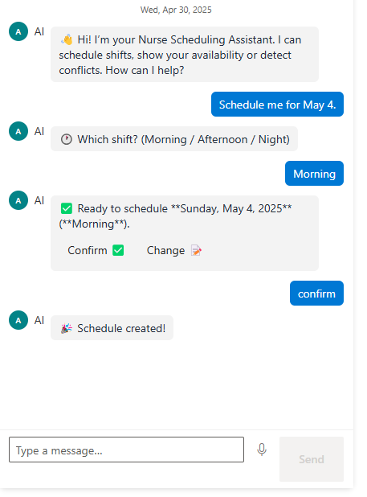
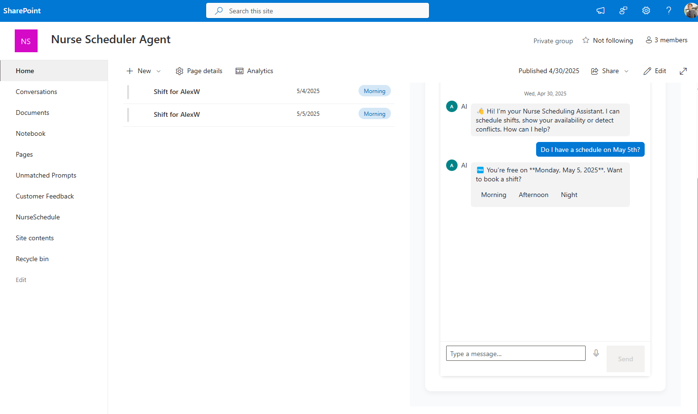
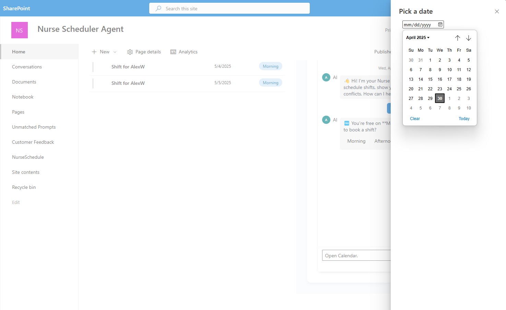

# Nurse Scheduler Assistant (v2)

A full-stack demo that lets nurses manage their shifts through a chat interface in SharePoint.

## 📁 Project Layout

| Folder              | Description                                     |
|---------------------|-------------------------------------------------|
| **spfx-frontend**   | SPFx web-part (chat UI) shown inside SharePoint |
| **nurse-intent-api**| Python/FastAPI service that parses messages, detects intent, and writes to the NurseSchedule list |

*(See each folder’s own `README.md` for full setup and design notes.)*

---

## ⏱ Quick Start (Local Dev)

> **Prerequisites:** Node 16 (for SPFx), Python 3.10+, and a SharePoint Online tenant.

### 1 – Backend  
```bash
cd nurse-intent-api
python -m venv venv
# Windows  ▸ venv\Scripts\activate
# macOS/Linux ▸ source venv/bin/activate
pip install -r requirements.txt
uvicorn main:app --reload      # http://localhost:8000
```
### 2 -- Frontend

```bash
cd spfx-frontend
npm install
gulp serve                     # opens the SharePoint workbench`
```

* * * *

💬 60-second demo script
------------------------

> 
> 

* * * *

📝 Required SharePoint list
---------------------------

`NurseSchedule` (or your chosen list) with columns:

| Column (type) | Purpose |
| --- |  --- |
| **User** (Person) | Nurse requesting the shift |
| **ShiftDate** (Date) | Date of the shift |
| **ShiftType** (Choice) | Morning / Afternoon / Evening / Night |